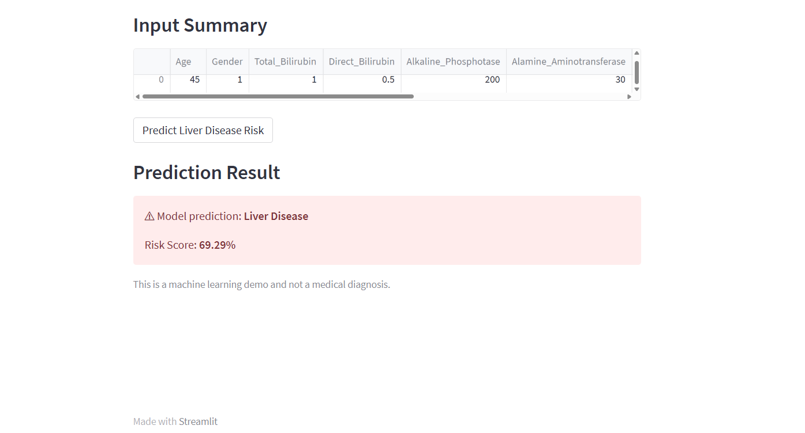

# Liver Disease Risk Prediction  

A machine-learning project that predicts the risk of liver disease in patients using clinical data, and exposes a simple web application built with Streamlit for interactive risk scoring.

## 🔎 What this project does

- Takes clinical input features (age, liver enzyme levels, albumin, etc.)  
- Uses a trained ML model to predict probability of liver disease  
- Returns a **risk score** (percentage) and a basic classification (Disease / No Disease)  
- Works through an interactive **Streamlit app** for easy use  


## 🖼️ Demo Screenshot

Here is the preview of the app when running locally or deployed:




## 🚀 How to Run Locally

```bash
# 1. Clone this repository
git clone https://github.com/ayesha-shaikh21/Liver-Disease-Prediction.git
cd Liver-Disease-Prediction

# 2. Install dependencies
pip install -r requirements.txt

# 3. Launch Streamlit app
streamlit run app.py


